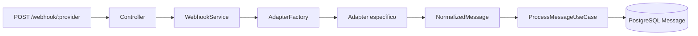

# supersdr-prova-tecnica

Serviço de normalização de webhooks para o SuperSDR: recebe payloads específicos de cada provedor, valida, converte para um formato interno único e persiste mensagens com tratamento idempotente.

## Arquitetura (camadas)

| Camada | Responsabilidade |
|--------|------------------|
| **HTTP** (`src/modules/webhook`) | Rota `POST /webhook/:provider`. OpenAPI em `src/openapi/`, `/docs` (focado em testes com body; segurança Z-API via env + header na integração real — ver seção Z-API). |
| **Aplicação** (`WebhookService`) | Orquestração: log, factory de adapter, parse, caso de uso de persistência. |
| **Domínio** (`NormalizedMessage`, erros) | Contrato único da mensagem recebida; erros de negócio com código HTTP. |
| **Provedores** (`adapters`, `AdapterFactory`) | Cada adapter valida com Zod e mapeia para `NormalizedMessage`. |
| **Caso de uso** (`ProcessMessageUseCase`) | Idempotência por `externalId` + gravação via Prisma. |
| **Infra** | Prisma + PostgreSQL, Pino, variáveis de ambiente validadas com Zod. |

Fluxo resumido: **webhook → controller → service → `AdapterFactory.getAdapter` → `adapter.parse` → `ProcessMessageUseCase.execute` → tabela `Message`.**



## Pattern e justificativa

**Adapter + Factory (GoF):** cada provedor tem um *adapter* que conhece apenas o formato daquele webhook; a *factory* escolhe o adapter pelo segmento da URL (`:provider`), com chave **normalizada** (`trim` + `toLowerCase`) para evitar divergência entre painéis e Postman. O problema de múltiplos formatos de entrada fica isolado nos adapters; o restante do sistema só enxerga `NormalizedMessage`.

## Extensibilidade (novo provedor)

1. Criar `src/providers/adapters/<nome>.adapter.ts` implementando `WebhookAdapter` + schema Zod do payload.
2. Registrar em `AdapterFactory` um novo `case '<nome>'`.
3. (Recomendado) Adicionar fixture em `test/fixtures/` e um teste em `reference-payload.contract.spec.ts` ou spec dedicado.
4. Não é necessário alterar controller nem o caso de uso de persistência, desde que o adapter produza `NormalizedMessage`.

## Tratamento de erros

| Cenário | Comportamento |
|---------|----------------|
| Webhook malformado | `PayloadValidationError` → HTTP 400, código `INVALID_PAYLOAD`. |
| Provedor desconhecido | `ProviderNotSupportedError` → HTTP 400, `PROVIDER_NOT_SUPPORTED`. |
| Falha no processamento | `AppError` com status explícito; demais erros → HTTP 500, `INTERNAL_ERROR` (log com Pino). |
| Z-API com token configurado e header inválido | `AppError` 401, `ZAPI_WEBHOOK_UNAUTHORIZED`. |

## Banco de dados (modelo)

Modelo `Message` no Prisma: `externalId` único (idempotência), `provider`, `from`, `content`, `createdAt`. Migrations versionadas em `prisma/migrations` (detalhes de comandos na seção abaixo).

## Integração com LLM (proposta, parte 2.2)

Após persistir a mensagem normalizada, um passo assíncrono (fila ou job) poderia chamar a API da OpenAI ou Anthropic com um prompt de sistema fixo para **classificar intenção** (ex.: `lead`, `suporte`, `spam`) e gravar o rótulo em nova coluna ou tabela `MessageIntent`. Para **resposta automática**, o mesmo fluxo poderia gerar texto e devolver ao canal via API do provedor — fora do escopo mínimo deste repositório, mas o desenho encaixa após `ProcessMessageUseCase` sem mudar contratos dos adapters.

## Payloads de referência do enunciado (seção 5)

Os JSON de referência da prova (seção 5) estão em `test/fixtures/` (`meta-cloud-reference.json`, `evolution-reference.json`, `zapi-reference.json`). O arquivo `src/providers/adapters/reference-payload.contract.spec.ts` garante que os três adapters produzem o mesmo texto normalizado **«Olá, gostaria de saber mais sobre o produto»** e os mesmos identificadores esperados — útil para regressão e para demonstrar aderência ao enunciado.

## Funcionalidades entregues (checklist)

- [x] Parte 1.1 — descrição de camadas e comunicação (este README + código).
- [x] Parte 1.2 — TypeScript funcional, Nest não obrigatório; Express; ≥2 provedores (**Meta, Evolution, Z-API**).
- [x] Parte 1.3 — pattern documentado.
- [x] Parte 1.4 — extensibilidade documentada + ponto único de registro na factory.
- [x] Parte 1.5 — erros mapeados no controller.
- [x] Parte 2.1 — PostgreSQL + Prisma + migrations.
- [x] Parte 2.2 — integração LLM descrita (acima).
- [x] Diferencial — testes unitários e de contrato com payloads de referência.
- [ ] Vídeo de apresentação (até 10 min) — link a incluir pelo candidato antes do envio.
- [ ] Repositório público no GitHub com commits claros (responsabilidade do candidato).

## Uso de IA

Ferramentas de IA (por exemplo Cursor) foram usadas para acelerar boilerplate, revisão de tipos e alinhamento com o enunciado; o código foi revisado manualmente, com testes automatizados para validar comportamento.

## Assunções explícitas

- Um request de webhook representa **uma** mensagem de texto relevante (exemplos da prova); payloads com múltiplas mensagens usam a primeira entrada compatível no adapter Meta.
- Timestamps: Meta em segundos (string), Evolution em segundos (número), Z-API `momment` em milissegundos quando presente.
- Provedor na URL é tratado de forma **case-insensitive**.

## Requisitos

- Node.js 20+
- PostgreSQL 14+

## Configuração

```bash
npm install
cp .env.example .env
```

Edite o `.env` e defina um `DATABASE_URL` válido.

Gere o Prisma Client:

```bash
npm run prisma:generate
```

## Banco de dados e migrations

O projeto usa **Prisma 7**. A URL do banco para o **Migrate** fica em `prisma.config.ts` (variável `DATABASE_URL`). Os arquivos SQL versionados ficam em `prisma/migrations` e devem ir para o Git.

**Primeira vez no ambiente local (desenvolvimento)**

Aplicar migrations já existentes e criar as tabelas:

```bash
npm run prisma:migrate:dev
```

Quando você alterar `schema.prisma` e precisar de uma nova migration, o Prisma pedirá um nome descritivo.

**Produção ou CI (sem prompts)**

Aplicar somente migrations já commitadas:

```bash
npm run prisma:migrate:deploy
```

**Conferir histórico de migrations vs banco**

```bash
npm run prisma:migrate:status
```

**Observação:** `npm run prisma:push` sincroniza o schema sem gerar arquivos de migration. Para a prova técnica, prefira **migrations** para qualquer mudança de schema que precise ser reproduzida a partir do repositório.

## Executar a API

```bash
npm run dev
```

- HTTP: `http://localhost:3000` (ou a porta definida no `.env`)
- Webhook: `POST /webhook/:provider` com `provider` em `zapi`, `meta` ou `evolution`
- Swagger UI: `/docs` — **facilitar testes manuais** (“Try it out”). Os exemplos de **resposta** (200, 400, …) são os mesmos objetos que o sistema serializa (gerados via adapters e erros reais, sem JSON “só para doc”). Textos de descrição sem markdown agressivo na UI. O header `Client-Token` da Z-API não aparece aqui (ver seção Z-API).


## Z-API (webhook real)

A Z-API só entrega webhooks em **HTTPS**. Para testar na sua máquina, use um túnel (por exemplo [ngrok](https://ngrok.com/), **Microsoft Dev Tunnels** ou Cloudflare Tunnel) apontando para a porta do `.env` (`PORT`).

### Onde colar a URL no painel (obrigatório)

Configure a URL **somente** no webhook **«Ao receber»** (mensagens que **chegam** na instância).

**Não** use **«Ao enviar»** para esse fluxo: esse campo é para eventos de mensagens **enviadas** por você pela API, com outro tipo de payload.

Exemplo de URL pública (túnel Microsoft Dev Tunnels + rota do projeto):

- `https://<subdominio>-<porta>.brs.devtunnels.ms/webhook/zapi` (troque `<subdominio>` e `<porta>` pelos valores do seu túnel)

### Validação em ambiente real

Este fluxo **foi validado** com instância Z-API real: webhook em **«Ao receber»**, túnel HTTPS e gravação na tabela `Message` (`provider = zapi`, `externalId` = `messageId` da Z-API).

### Fuso horário e coluna `createdAt`

O horário gravado em `createdAt` vem do **`momment`** do payload da Z-API (timestamp em **milissegundos**, epoch UTC), quando o campo vem preenchido; caso contrário, usa o relógio do processo Node (`new Date()`).

No PostgreSQL o Prisma usa `timestamp(3)` **sem** fuso (`timestamp without time zone`): o valor é armazenado como “relógio civil” que o driver envia. Se o **servidor do Postgres**, o **cliente SQL** (DBeaver, etc.) ou o **processo Node** estiverem com **timezone em UTC**, e você comparar mentalmente com **América/São_Paulo** (UTC−3), é comum parecer **+3 horas** de diferença na visualização — não é causado pelo domínio do túnel (`devtunnels.ms`), e sim por **UTC vs horário de Brasília** na cadeia “origem do timestamp → gravação → ferramenta que exibe”.

Para conferir no banco:

```sql
SHOW TIMEZONE;
SELECT "createdAt" AT TIME ZONE 'UTC' AT TIME ZONE 'America/Sao_Paulo' AS created_at_sp FROM "Message" LIMIT 5;
```

Se no futuro quiser padronizar tudo com fuso explícito no Postgres, a evolução natural é migrar para `timestamptz` e alinhar `TimeZone` da sessão ou da instância.

**Token (`Client-Token`, opcional mas recomendado em produção)**

1. No painel da Z-API, copie o token de segurança da conta ([documentação](https://developer.z-api.io/security/client-token)).
2. No `.env`, defina o mesmo valor em `ZAPI_CLIENT_TOKEN`. Com isso, todo `POST /webhook/zapi` precisa do header `Client-Token: <mesmo valor>`.
3. Se **não** definir `ZAPI_CLIENT_TOKEN`, o endpoint aceita o webhook sem checagem de header (útil para Postman / dev local).

Payloads reais podem trazer campos extras (por exemplo `instanceId`); o adapter aceita campos adicionais e normaliza `messageId`, `phone`, `text` e `momment` quando presentes.

## Testes

```bash
npm test
```
